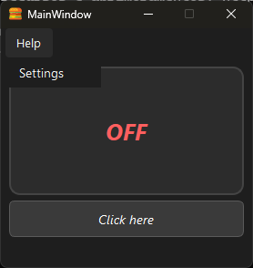
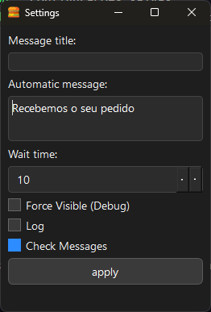

# AssistenteWhatsmenu

Automatize o envio de mensagens de confirmação de pedidos do Whatsmenu diretamente pelo WhatsApp Web, com interface gráfica e integração fácil.

---

## Sobre o Projeto

O **AssistenteWhatsmenu** é uma ferramenta para estabelecimentos de delivery que integra o painel do Whatsmenu ao WhatsApp Web, enviando mensagens automáticas de confirmação para os clientes. O objetivo é agilizar o atendimento e evitar mensagens duplicadas.

---

## Funcionalidades

- Monitoramento automático de novos pedidos no Whatsmenu
- Envio automático de mensagens personalizadas pelo WhatsApp Web
- Interface gráfica intuitiva (PySide6)
- Configuração fácil de mensagens, tempo de espera e modo debug
- Evita envio duplicado de mensagens para o mesmo cliente no mesmo dia
- Sistema de logs para depuração

---

## Instalação

1. **Clone o repositório:**
   ```bash
   git clone https://github.com/vinicius342/AssistenteWhatsmenu.git
   cd AssistenteWhatsmenu
   ```
2. **Crie e ative um ambiente virtual (recomendado):**
   ```bash
   python -m venv venv
   venv\Scripts\activate
   ```
3. **Instale as dependências:**
   ```bash
   pip install -r requirements.txt
   ```
4. **Execute o programa:**
   ```bash
   python main.py
   ```

---

## Como usar

- Execute o programa normalmente.
- Na primeira execução, faça login no WhatsApp Web e no painel do Whatsmenu quando solicitado.
- Feche as janelas do navegador e reinicie o programa após o login.
- Acesse o menu **Settings** na interface para configurar:
  - Título da mensagem
  - Mensagem automática
  - Tempo de espera entre verificações
  - Forçar modo visível (debug)
  - Ativar/desativar logs
  - Verificar mensagens duplicadas

---

## Estrutura do Projeto

- `main.py`: Arquivo principal para iniciar o sistema
- `mainwindow.py`: Interface principal
- `settings_window.py`: Janela de configurações
- `whatsapp.py`: Automação do WhatsApp Web
- `whatsmenu.py`: Automação do painel Whatsmenu
- `utils.py`: Utilitários e configurações
- `log.py`: Sistema de logs
- `requirements.txt`: Dependências do projeto
- `settings.json`: Configurações salvas
- `list_checked.txt`: Lista de números já processados
- `ui/`: Arquivos de interface Qt Designer
- `icon/`: Ícones e recursos
- `profile_whatsapp/`: Perfil do Chrome para WhatsApp
- `profile_whatsmenu/`: Perfil do Chrome para Whatsmenu

---

## Prints da Interface



---

## Licença

Este projeto está licenciado sob a licença MIT. Veja o arquivo `LICENSE` para mais informações.

---

Desenvolvido por [vinicius342](https://github.com/vinicius342)
